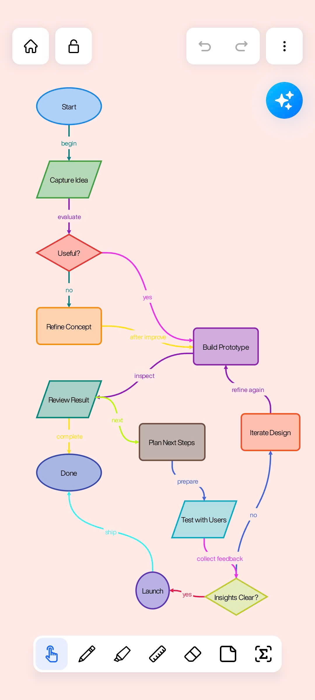
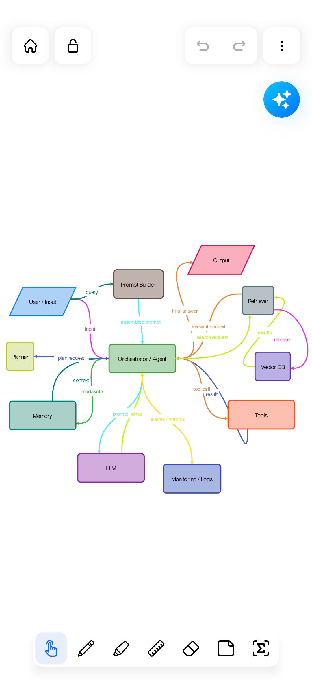
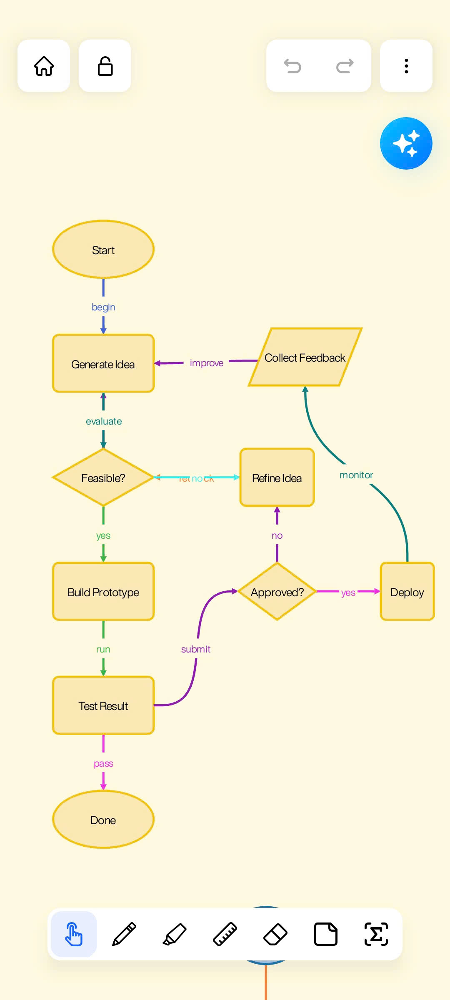
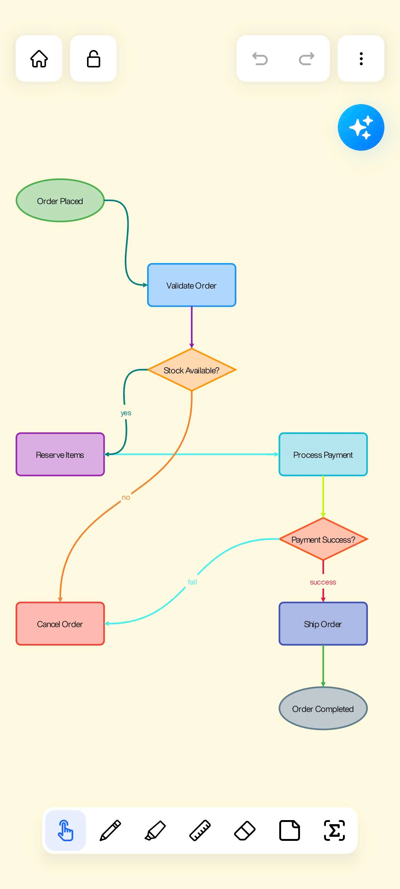
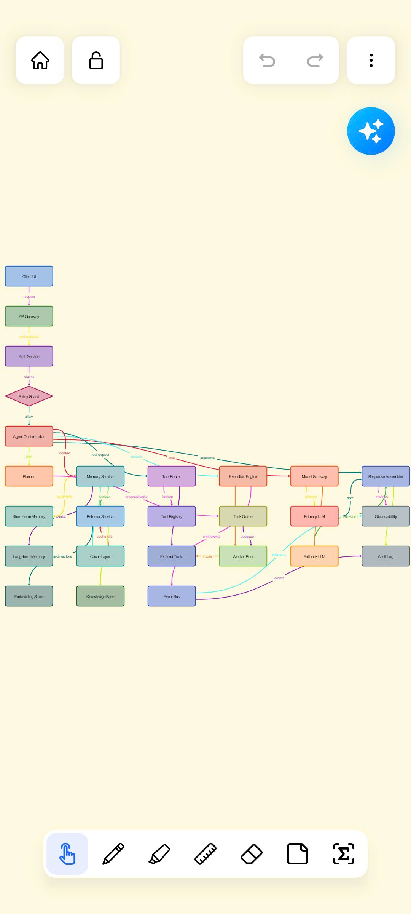
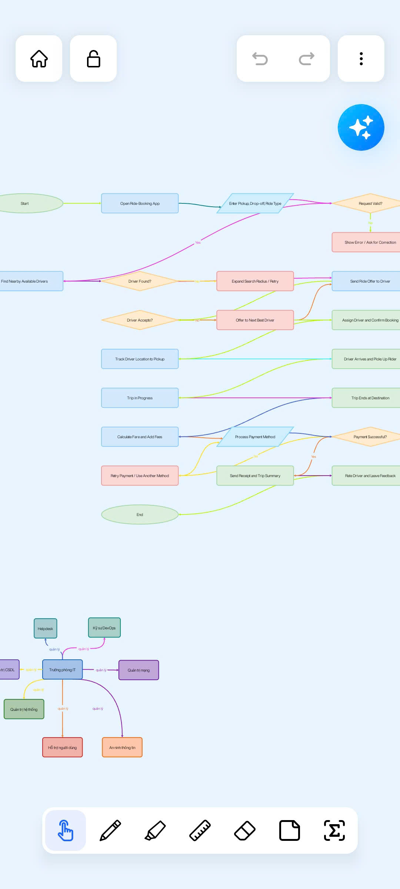
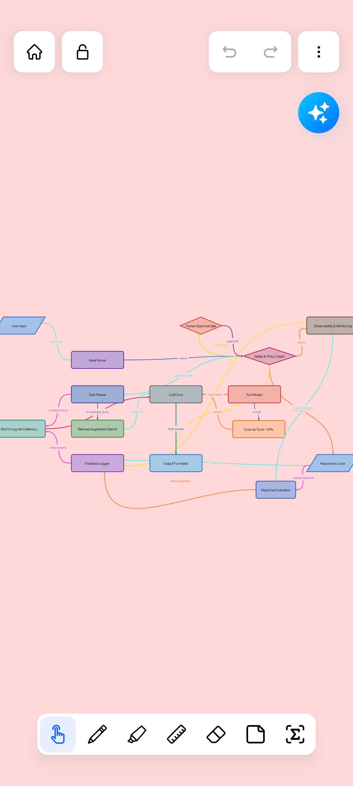
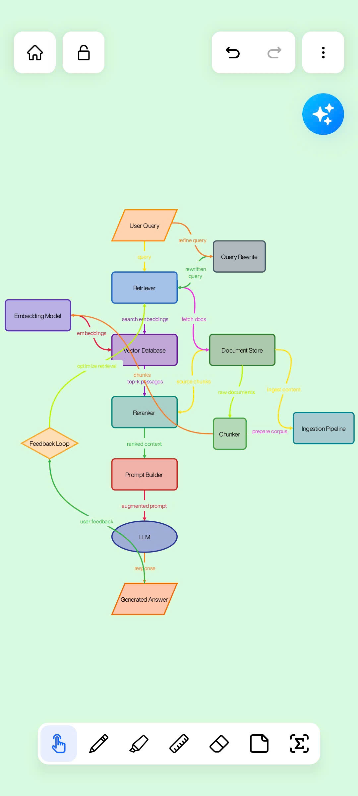

# AI Diagram Agent

AI Diagram Agent is an experimental feature built for the mobile note-taking application Noteen. The feature integrates a multi-agent architecture into the app, allowing users to interact with an AI assistant through natural language to generate, edit, and update diagrams directly on a collaborative whiteboard in real time.

The agent is capable of understanding user requests, answering questions, and continuously updating diagram structures based on ongoing interactions.

This feature has not been officially published in the production version of the app yet. It was initially developed as part of a graduation thesis project.

## Noteen App

- Google Play: https://play.google.com/store/apps/details?id=com.devkun.noteen&hl=en-US&ah=OlZPkTq5uYo8ZNTbk0T-LqD6kvc

## Demo Screenshots

  
  
  
  

  
  
  
  

## Video Demo

[Watch Demo Video](./assets/diagram_agent_demo.mp4)
